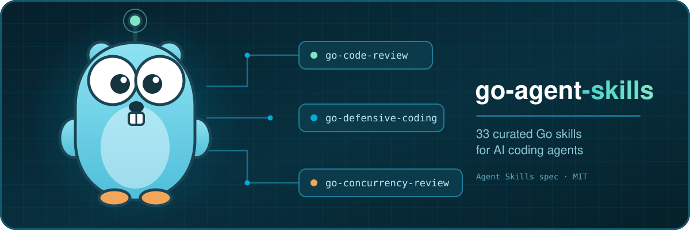

<p align="center">
  
</p>

<p align="center">
  <a href="https://skills.sh/eduardo-sl/go-agent-skills"></a>
  <a href="https://agentskills.io/specification.md"></a>
  <a href="https://github.com/eduardo-sl/go-agent-skills/actions/workflows/validate.yml"></a>
  <a href="LICENSE"></a>
</p>

<h3 align="center">Curated Go skills for AI coding agents. One command, works everywhere.</h3>

```bash
npx skills add eduardo-sl/go-agent-skills
```

> [!IMPORTANT]
> An agent is only as good as the context you hand it. Without Go-specific
> guidance it writes Java-flavoured Go: naked `err` returns, producer-side
> interfaces, goroutines nobody stops, `interface{}` where generics belong.
>
> These 33 skills encode how experienced Go engineers actually work — grounded in
> the [Uber Go Style Guide](https://github.com/uber-go/guide),
> [Effective Go](https://go.dev/doc/effective_go), and
> [Go Code Review Comments](https://go.dev/wiki/CodeReviewComments) — and they load
> **on demand**, so they cost nothing until they are relevant.

---

## 🚀 Install

Works with **Claude Code**, **Cursor**, **Codex**, **GitHub Copilot**, **Windsurf**,
**OpenCode**, **Cline**, and [37+ more agents](https://github.com/vercel-labs/skills#available-agents)
via the [`npx skills`](https://skills.sh) CLI.

```bash
# Everything, interactive — picks up the agents you have installed
npx skills add eduardo-sl/go-agent-skills

# Look before you leap
npx skills add eduardo-sl/go-agent-skills --list

# Just the ones you want
npx skills add eduardo-sl/go-agent-skills --skill go-code-review --skill go-defensive-coding

# Globally, for every project
npx skills add eduardo-sl/go-agent-skills -g

# Non-interactive, for CI
npx skills add eduardo-sl/go-agent-skills --all -y
```

<details>
<summary><b>Claude Code</b> — plugin marketplace</summary>

```bash
/plugin marketplace add eduardo-sl/go-agent-skills
/plugin install go-agent-skills@eduardo-sl
```

Or drop them straight in: `npx skills add eduardo-sl/go-agent-skills -a claude-code`

</details>

<details>
<summary><b>Cursor</b></summary>

```bash
npx skills add eduardo-sl/go-agent-skills -a cursor
```

Cursor auto-discovers skills from `.cursor/skills/` and `.agents/skills/`.

</details>

<details>
<summary><b>GitHub Copilot</b></summary>

```bash
npx skills add eduardo-sl/go-agent-skills -a copilot
```

Copilot auto-discovers skills from `.github/skills/`.

</details>

<details>
<summary><b>Codex (OpenAI)</b></summary>

```bash
npx skills add eduardo-sl/go-agent-skills -a codex
```

Codex auto-discovers skills from `~/.agents/skills/` and `.agents/skills/`.

</details>

<details>
<summary><b>Windsurf · OpenCode · Cline</b></summary>

```bash
npx skills add eduardo-sl/go-agent-skills -a windsurf
npx skills add eduardo-sl/go-agent-skills -a opencode
npx skills add eduardo-sl/go-agent-skills -a cline
```

</details>

<details>
<summary><b>Shell installer</b> — no Node required</summary>

```bash
git clone https://github.com/eduardo-sl/go-agent-skills.git
./go-agent-skills/scripts/install.sh /path/to/your-go-project --agent claude

# See what it would do first
./go-agent-skills/scripts/install.sh /path/to/project --agent claude --dry-run

# Symlink instead of copy, to stay in sync with the repo
./go-agent-skills/scripts/install.sh /path/to/project --agent claude --symlink
```

</details>

<details>
<summary><b>Manual copy</b></summary>

```bash
mkdir -p .claude/skills && cp -r go-agent-skills/skills/*/* .claude/skills/   # Claude Code
mkdir -p .cursor/skills && cp -r go-agent-skills/skills/*/* .cursor/skills/   # Cursor
mkdir -p .github/skills && cp -r go-agent-skills/skills/*/* .github/skills/   # Copilot
mkdir -p .agents/skills && cp -r go-agent-skills/skills/*/* .agents/skills/   # Codex / OpenCode
```

</details>

<details>
<summary><b>Managing what you installed</b></summary>

```bash
npx skills check      # anything out of date?
npx skills update     # bring them current
npx skills list       # what is installed
npx skills remove go-performance-review
```

</details>

---

## 🗺 The map

```text
                            ┌───────────────────────────┐
                            │      go-skills-router     │  ← "which skill is this?"
                            └─────────────┬─────────────┘
                                          │
   ┌──────────────┬──────────────┬────────┴─────┬──────────────┬──────────────┐
   ▼              ▼              ▼              ▼              ▼              ▼
┌────────────┐┌────────────┐┌────────────┐┌────────────┐┌────────────┐┌────────────┐
│Code Quality││Architecture││   Data     ││Safety&Perf ││  Testing   ││  Workflow  │
├────────────┤├────────────┤├────────────┤├────────────┤├────────────┤├────────────┤
│coding-stds ││arch-review ││ database   ││concurrency ││test-quality││ dep-audit  │
│code-review ││proj-layout ││            ││  -review   ││test-table  ││ ci         │
│error-handl ││iface-design││            ││security    ││  -driven   ││ refactoring│
│context     ││api-design  ││            ││  -audit    ││            ││ semantic   │
│modernize   ││openapi     ││            ││defensive   ││            ││  -tools    │
│data-structs││graphql     ││            ││  -coding   ││            ││ binary-size│
│docs        ││grpc        ││            ││performance ││            ││ skills     │
│            ││design-patt ││            ││  -review   ││            ││  -router   │
│            ││dep-inject  ││            ││observabil. ││            ││ git-commit │
│            ││cli         ││            ││troublesh.  ││            ││            │
└────────────┘└────────────┘└────────────┘└────────────┘└────────────┘└────────────┘
```

Unsure which one applies? That is what [`go-skills-router`](skills/(workflow)/go-skills-router/)
is for — it maps a task to the skill that owns it, and draws the boundary when two overlap.

---

## 📊 Catalogue

Skills load automatically from context. You can also invoke one directly:
`/go-code-review`.

**Reading the columns.** `Desc` is the description weight, loaded at startup for
*every* skill — it is what makes a skill trigger. `SKILL.md` is what loads when
one fires. `Tree` includes the `references/` files, which load only when the
skill sends the agent to them. 📚 marks a skill with reference files.
All figures are approximate tokens (bytes ÷ 4).

### Code Quality

| Skill | What it does | Triggers | Desc | SKILL.md | Tree |
| --- | --- | --- | ---: | ---: | ---: |
| [`go-code-review`](skills/(code-quality)/go-code-review/) | Structured review process with severity classification | "review this code", "check this PR" | 111 | 1,608 | 1,621 |
| [`go-coding-standards`](skills/(code-quality)/go-coding-standards/) | Style conventions, naming, imports, struct init, formatting | "check Go style", "fix formatting" | 137 | 2,124 | 2,139 |
| [`go-context`](skills/(code-quality)/go-context/) | Context propagation, cancellation, timeouts, values | "context usage", "timeout", "context cancellation" | 118 | 2,283 | 2,302 |
| [`go-data-structures`](skills/(code-quality)/go-data-structures/) | Slices, maps, sets, aliasing, preallocation, nil vs empty | "nil slice", "map iteration", "slice aliasing" | 145 | 1,497 | 1,508 |
| [`go-documentation`](skills/(code-quality)/go-documentation/) | Godoc conventions, testable examples, deprecation notices | "add godoc", "document this package" | 112 | 1,422 | 1,428 |
| [`go-error-handling`](skills/(code-quality)/go-error-handling/) | Error wrapping, sentinels, custom types, `errors.Is`/`As` | "handle errors", "error wrapping" | 139 | 1,573 | 1,583 |
| [`go-modernize`](skills/(code-quality)/go-modernize/) 📚 | Generics, slog, errors.Join, slices/maps, range-over-func | "modernize", "use generics", "update Go" | 136 | 2,256 | 4,467 |

### Architecture & Design

| Skill | What it does | Triggers | Desc | SKILL.md | Tree |
| --- | --- | --- | ---: | ---: | ---: |
| [`go-api-design`](skills/(architecture)/go-api-design/) | REST/gRPC handlers, middleware, graceful shutdown, pagination | "design API", "HTTP handler" | 150 | 1,959 | 1,968 |
| [`go-architecture-review`](skills/(architecture)/go-architecture-review/) | Package layout, dependency direction, layering, `internal/` | "review architecture", "project layout" | 135 | 2,038 | 2,121 |
| [`go-cli`](skills/(architecture)/go-cli/) | Flags, subcommands, exit codes, signals, Cobra decision point | "build a CLI", "handle Ctrl+C", "exit codes" | 125 | 1,372 | 1,378 |
| [`go-dependency-injection`](skills/(architecture)/go-dependency-injection/) | Constructor injection, composition root, wire/fx trade-offs | "dependency injection", "remove global state" | 126 | 1,529 | 1,537 |
| [`go-design-patterns`](skills/(architecture)/go-design-patterns/) 📚 | Functional options, factory, strategy, middleware/decorator | "design pattern", "functional options" | 127 | 1,551 | 3,465 |
| [`go-graphql`](skills/(architecture)/go-graphql/) | gqlgen schema-first, resolvers, dataloaders, complexity limits, field auth | "GraphQL", "gqlgen", "N+1 queries", "dataloader" | 165 | 2,219 | 2,224 |
| [`go-grpc`](skills/(architecture)/go-grpc/) | Proto design, status codes, interceptors, deadlines, streaming | "gRPC service", "interceptor", "proto design" | 126 | 1,714 | 1,718 |
| [`go-interface-design`](skills/(architecture)/go-interface-design/) | Consumer-side interfaces, composition, compliance checks | "design interface", "accept interfaces" | 148 | 1,952 | 1,973 |
| [`go-openapi`](skills/(architecture)/go-openapi/) | Spec-first REST with oapi-codegen, validation middleware, oasdiff, contract tests | "OpenAPI", "oapi-codegen", "generate a client from the spec" | 188 | 2,060 | 2,065 |
| [`go-project-layout`](skills/(architecture)/go-project-layout/) | Scaffolding new projects: cmd/internal, module naming, thin main | "new Go project", "scaffold a service" | 129 | 1,506 | 1,547 |

### Data

| Skill | What it does | Triggers | Desc | SKILL.md | Tree |
| --- | --- | --- | ---: | ---: | ---: |
| [`go-database`](skills/(data)/go-database/) 📚 | Connection pools, transactions, sqlc, migrations, repository pattern | "database access", "SQL query", "transactions" | 127 | 1,400 | 2,891 |

### Safety & Performance

| Skill | What it does | Triggers | Desc | SKILL.md | Tree |
| --- | --- | --- | ---: | ---: | ---: |
| [`go-concurrency-review`](skills/(safety)/go-concurrency-review/) | Goroutine lifecycle, channels, mutexes, race detection | "check thread safety", "goroutine leak" | 145 | 1,974 | 1,996 |
| [`go-defensive-coding`](skills/(safety)/go-defensive-coding/) 📚 | Typed-nil interfaces, slice aliasing, integer overflow, defensive copying | "nil pointer panic", "integer overflow", "defensive copy" | 200 | 2,568 | 5,220 |
| [`go-observability`](skills/(safety)/go-observability/) | Structured logging (slog), tracing, metrics, OpenTelemetry | "add logging", "tracing", "metrics" | 122 | 2,399 | 2,415 |
| [`go-performance-review`](skills/(safety)/go-performance-review/) | Allocations, benchmarking, pprof, hot path optimization | "check performance", "reduce allocations" | 139 | 1,967 | 1,986 |
| [`go-security-audit`](skills/(safety)/go-security-audit/) | OWASP, SQL injection, auth, secrets, input validation | "security review", "check vulnerabilities" | 143 | 2,287 | 2,307 |
| [`go-troubleshooting`](skills/(safety)/go-troubleshooting/) | Panics, deadlocks, memory/goroutine leaks, pprof diffing, delve | "debug this panic", "memory leak", "deadlock" | 133 | 1,630 | 1,639 |

### Testing

| Skill | What it does | Triggers | Desc | SKILL.md | Tree |
| --- | --- | --- | ---: | ---: | ---: |
| [`go-test-quality`](skills/(testing)/go-test-quality/) 📚 | Test philosophy, subtests, httptest, golden files, fuzz, testcontainers | "add tests", "improve coverage" | 199 | 2,616 | 4,637 |
| [`go-test-table-driven`](skills/(testing)/go-test-table-driven/) 📚 | Deep dive on table-driven tests: when to use, struct design, refactoring | "table-driven test", "test matrix" | 171 | 1,608 | 4,255 |

### Workflow

| Skill | What it does | Triggers | Desc | SKILL.md | Tree |
| --- | --- | --- | ---: | ---: | ---: |
| [`git-commit`](skills/(workflow)/git-commit/) | Conventional Commits, atomic commits, pre-commit verification | "commit changes", "commit message" | 119 | 1,438 | 1,443 |
| [`go-binary-size`](skills/(workflow)/go-binary-size/) | Linker flags, inlining, CGO, build tags, embedded assets, image size | "binary is too big", "shrink the binary", "reduce image size" | 163 | 1,903 | 1,910 |
| [`go-ci`](skills/(workflow)/go-ci/) | GitHub Actions, golangci-lint, coverage gates, Makefile parity | "set up CI", "add lint to pipeline" | 135 | 1,401 | 1,405 |
| [`go-dependency-audit`](skills/(workflow)/go-dependency-audit/) | Module hygiene, `govulncheck`, dep evaluation, go.mod review | "check dependencies", "audit deps" | 142 | 1,533 | 1,544 |
| [`go-refactoring`](skills/(workflow)/go-refactoring/) | Behavior-preserving steps, extract package, strangler migrations | "refactor this", "break circular dependency" | 147 | 1,454 | 1,461 |
| [`go-semantic-tools`](skills/(workflow)/go-semantic-tools/) | gopls navigation, go list dependency graphs, semantic rename | "find all callers", "who implements this" | 148 | 1,295 | 1,299 |
| [`go-skills-router`](skills/(workflow)/go-skills-router/) | Routes a task to the skill that owns it, plus the secondary skills to load | "which skill should I use", "what Go skills do you have" | 176 | 2,112 | 2,125 |

**Budget.** All 33 descriptions together are ~4,726 tokens at startup. A typical
session fires 2–4 skills, so ~5,475 tokens of body. The full tree is
~73,577 tokens and is never loaded at once — that is the point of progressive
disclosure.

---

## 🧪 Evaluations

A skill that does not change the output is a skill that costs context for
nothing. `evals/` is the harness that tells the difference:

```bash
scripts/run-evals.py --cmd 'claude -p "{prompt}"' --label with-skills
scripts/run-evals.py --cmd 'claude -p "{prompt}"' --label baseline
```

Same suite, run in a project with the skills and in one without. The delta is
the measurement. Case format and guidance: [`evals/README.md`](evals/README.md).

> [!NOTE]
> No scores are published here. They depend on the model, its version, and the
> day, and a number without those three recorded is decoration. Run the suite
> against your own agent and judge for yourself.

---

## 🔐 Security

Skills are prompts injected into an agent that already holds shell and
file-write access. This repo treats them as security-sensitive:

- Every skill declares **least-privilege `allowed-tools`**. Review and audit
  skills cannot write. Every `Bash(...)` grant is scoped to one binary.
- No skill fetches remote content or runs downloaded code. The only external
  hosts referenced anywhere in `skills/` are `github.com` and `localhost`.
- `scripts/validate.sh` rejects unscoped `Bash`, and rejects any skill that
  declares itself read-only while asking for `Write`.
- Published skills are scanned by [skills.sh](https://www.skills.sh/eduardo-sl/go-agent-skills)
  (Socket, Snyk, Gen Agent Trust Hub).

Threat model and private disclosure: [SECURITY.md](SECURITY.md).

---

## 🧱 Repository structure

```text
go-agent-skills/
├── skills/(category)/skill-name/
│   ├── SKILL.md                    # ≤500 lines: procedure, patterns, checklist
│   └── references/                 # depth, loaded only when SKILL.md says so
├── evals/
│   ├── README.md                   # how to measure a skill's worth
│   └── cases/                      # prompt + assertion suites
├── scripts/
│   ├── install.sh                  # shell installer (--dry-run, --symlink)
│   ├── run-evals.py                # drives any agent CLI
│   └── validate.sh                 # format, frontmatter, tools, catalogue sync
├── docs/
│   ├── SKILL_GUIDELINES.md         # quality bar for authoring
│   └── skill-gap-analysis.md       # what exists, what was rejected, and why
│
│  # platform discovery — all must list the same skills, and CI checks it
├── AGENTS.md · CLAUDE.md · .claude-plugin/marketplace.json
├── .cursor/rules/ · .windsurf/rules/ · .clinerules · .github/copilot-instructions.md
└── .opencode/config.json
```

---

## 🎯 Design principles

**Written for agents, not readers.** Imperative steps, ✅/❌ contrast pairs, and
a verification checklist that closes every skill. Agents learn from contrast,
not prose.

**Negative triggers earn their keep.** Every description states what the skill
does *not* cover and names the one that does. Wrong-skill activation is more
expensive than no activation.

**Verification is executable.** Where a tool can prove a rule — `go vet`,
`golangci-lint`, `govulncheck`, `go test -race` — the skill runs it instead of
asking the agent to judge.

**Progressive disclosure.** SKILL.md stays under 500 lines. Depth lives in
`references/` and loads only on demand.

**Self-contained.** No skill requires another to have been loaded. They name
each other as pointers only. `go-skills-router` is the one index, and it is
optional too.

---

## 🎚 Tuning triggers

If a skill fires too often, or never fires when it should, the `description`
field is the lever — it is the entire triggering mechanism.
[Open an issue](https://github.com/eduardo-sl/go-agent-skills/issues) with the
prompt that misrouted and the skill you expected. Small wording changes move
trigger accuracy a lot.

Adapting to your team's conventions: fork it, edit the SKILL.md files, install
from your fork with `npx skills add your-org/go-agent-skills`. Common
customisations are the golangci-lint ruleset, import grouping, and preferred
libraries.

---

## ✍️ Contributing

Budget, per skill:

| | Target |
|---|---|
| `description` | ~100–200 tokens. What it does, when to fire, when *not* to |
| `SKILL.md` | 1,500–2,500 tokens. Procedure and patterns, nothing else |
| `references/*.md` | Whatever depth needs, loaded on demand |
| Full tree | Under ~10,000 tokens |

Every PR must pass `./scripts/validate.sh` and ship at least one eval case that
fails without the skill. Full guidelines: [CONTRIBUTING.md](CONTRIBUTING.md)
and [docs/SKILL_GUIDELINES.md](docs/SKILL_GUIDELINES.md).

---

## 🙏 Standing on

- [Uber Go Style Guide](https://github.com/uber-go/guide/blob/master/style.md) — the base for most conventions
- [Effective Go](https://go.dev/doc/effective_go) — official Go team guidance
- [Go Code Review Comments](https://go.dev/wiki/CodeReviewComments) — community review standards
- [Agent Skills](https://agentskills.io/) — the open skill specification
- [Vercel Skills CLI](https://github.com/vercel-labs/skills) — the `npx skills` distribution ecosystem
- [Anthropic Skills](https://github.com/anthropics/skills) — patterns for production-grade skills

The Go gopher was designed by [Renée French](https://reneefrench.blogspot.com/)
and is licensed [CC BY 3.0](https://creativecommons.org/licenses/by/3.0/). The
banner above is an original drawing in that spirit.

## 📝 License

[MIT](LICENSE) © [Eduardo Spinelli de Lima](https://github.com/eduardo-sl)
